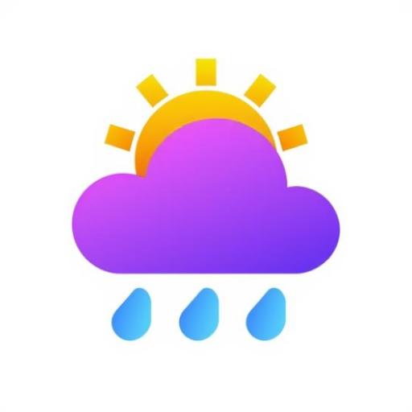
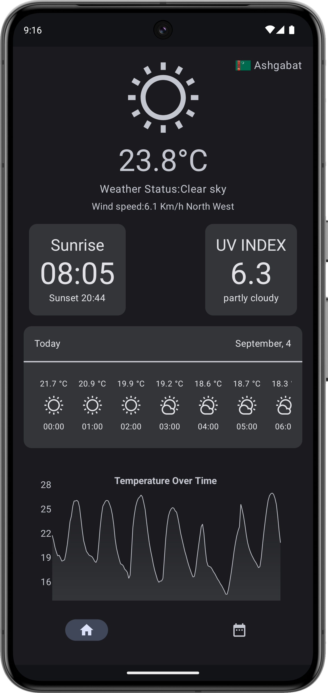
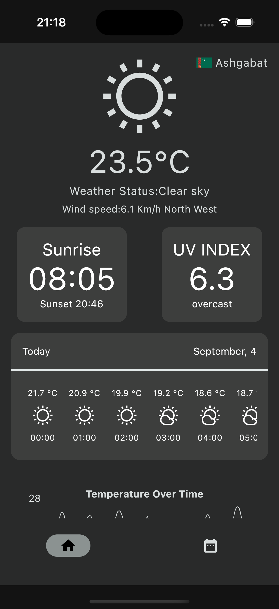
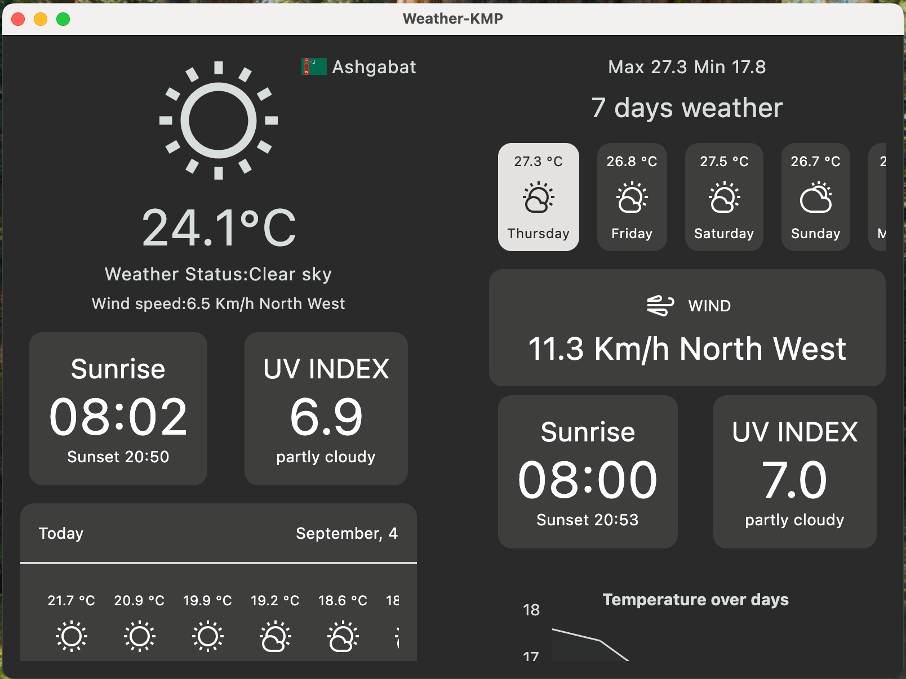

# Weather-KMP 🌤️

 <!-- Replace with your actual logo URL -->

A modern, cross-platform weather application built with **Kotlin Multiplatform (KMP)** to deliver real-time weather updates and forecasts. Weather-KMP leverages a shared codebase to provide a seamless experience across **Android**, **iOS**, and potentially other platforms, with a focus on clean architecture, modern design, and robust performance.

## ✨ Features

- **Cross-Platform Compatibility**: Write once, run on Android and iOS with shared business logic using Kotlin Multiplatform.
- **Real-Time Weather Data**: Fetches up-to-date weather information using the [Open-Meteo API](https://open-meteo.com/) for accurate forecasts.
- **Location-Based Weather**: Automatically detects your current location or allows manual city searches.
- **Detailed Forecasts**: Displays current conditions, hourly, and daily forecasts, including temperature, humidity, wind speed, and more.
- **Modern UI**: Built with **Jetpack Compose** for Android and **SwiftUI** (or equivalent) for iOS, offering a sleek and responsive interface.
- **Offline Support**: Caches recent weather data for offline access.
- **Scalable Architecture**: Follows clean architecture principles with a modular, testable codebase.
- **Customizable Themes**: Supports light and dark modes with dynamic theming.

## 📸 Screenshots

| Android                             | iOS                         | Desktop                             |
|-------------------------------------|-----------------------------|-------------------------------------|
|  |  |  |

*Replace the placeholder image URLs above with your actual screenshot URLs.*

## 🛠️ Tech Stack

- **Kotlin Multiplatform (KMP)**: For shared business logic across platforms.
- **Jetpack Compose**: Modern Android UI toolkit for a dynamic and responsive interface.
- **Ktor Client**: Asynchronous HTTP client for API requests.
- **Kotlin Coroutines**: For handling asynchronous operations and data flows.
- **Open-Meteo API**: Free, reliable weather data source with no API key required.
- **Room**: For cross-platform database management and offline caching.
- **Koin**: Dependency injection for modular and testable code.

## 🚀 Getting Started

### Prerequisites

- **Android Studio**: Latest version with Kotlin plugin installed.
- **Xcode**: For iOS development (if targeting iOS).
- **JDK**: Version 17 or higher.
- **Git**: To clone the repository.

Please follow the [Code of Conduct](CODE_OF_CONDUCT.md) and ensure your code adheres to the project's style guidelines.

## 📜 License

This project is licensed under the MIT License. See the [LICENSE](LICENSE) file for details.

## 📥 Download

You can download the latest version of the README.md file [here](https://raw.githubusercontent.com/mammetmyrat/Weather-KMP/main/README.md).

## 📬 Contact

For questions or feedback, reach out via [GitHub Issues](https://github.com/mammetmyrat/Weather-KMP/issues) or contact the maintainer at [mammetmyrat20020709@gmail.com](mailto:your-email@example.com).

---

Built with ❤️ by [Mammetmyrat](https://github.com/mammetmyrat). Happy coding!